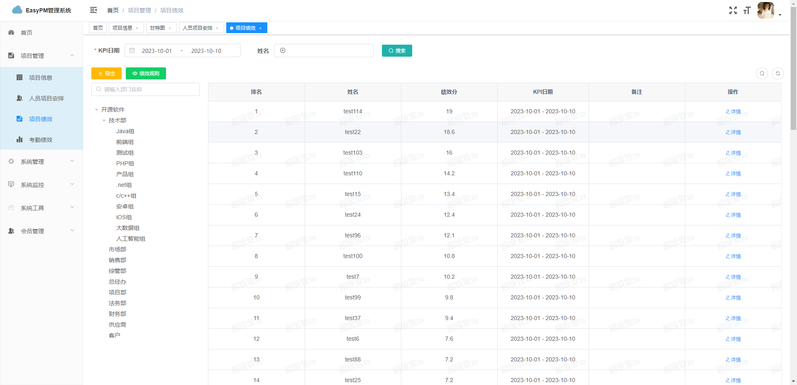
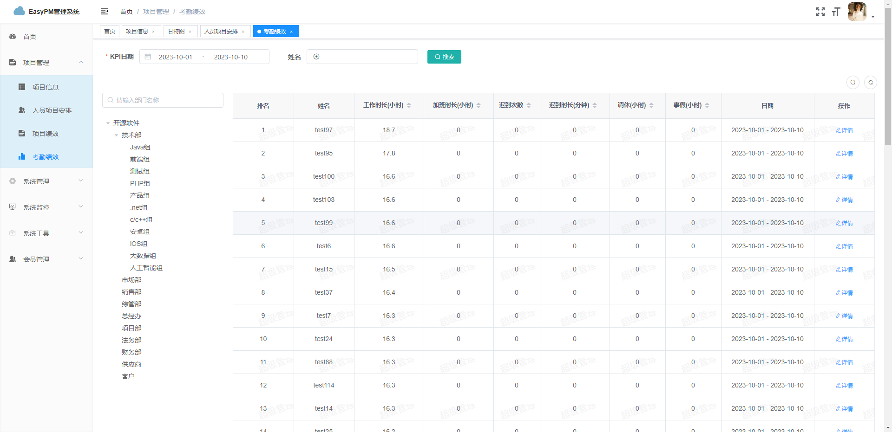

## 项目介绍

`EasyPM`是一套轻量级项目管理系统，采用了 Spring Boot 2.4、Oauth2、MyBatis-Plus、Docker等核心技术，同时提供了基于Vue的管理后台方便快速搭建系统。
以往常规的项目管理系统同质化比较高，TAPD，云效，飞书等都可满足日常的软件项目开发需求，但如果在中小软件公司，项目数量比较多，则需要一款便捷的项目总体看板系统，
用来展示项目宏观整体情况，或者需要有统一的人员管理调度管理系统，那EasyPM就能帮上大忙，主打轻量级，自动化，即修即改，简单容易上手。


## 组织结构

``` lua
mall
├── doc --系统部署文档
├── easy-pm-admin -- 管理端核心功能Controller模块
├── easy-pm-admin -- 移动端核心功能Controller模块（未启动）
├── easy-pm-common -- 工具类及通用代码模块
├── easy-pm-srv -- 系统service模块、model模块和mybatis mapper模块
├── easy-pm-third -- 第三方工具模块
├── mdframework -- 文件上传目录
├── runScript -- 部署到服务器，启动jar脚本示例
└── sql -- 数据库初始脚本
```

## 系统功能列表

| 系统功能       | 基础版 |                  进阶版                  |
|------------|:---:|:-------------------------------------:|
| 项目管理       |  有  |                   有                   |
| 项目导入导出     |  无  |                   有                   |
| 项目人员安排     |  有  |                   有                   |
| 页面水印       |  有  |                   有                   |
| 用户管理       |  有  |                   有                   |
| 部门管理       |  有  |                   有                   |
| 岗位管理       |  有  |                   有                   |
| 菜单管理       |  有  |                   有                   |
| 角色管理       |  有  |                   有                   |
| 定时任务       |  有  |                   有                   |
| 服务监控       |  有  |                   有                   |
| 代码生成       |  有  |                   有                   |
| 系统接口       |  有  |                   有                   |
| 操作日志       |  有  |                   有                   |
| 登录日志       |  有  |                   有                   |
| 在线用户       |  有  |                   有                   |
| 项目绩效核算     |  无  |                   有                   |
| 考勤绩效核算     |  无  |                   有                   |
| 自动同步企业微信用户 |  无  |                   有                   |
| 自动同步钉钉考勤   |  无  |                   有                   |
| 甘特图        |  无  |                   有                   |
| 自动邮件提醒     |  无  |                   有                   |


## AdminUI前端项目地址

- 前端项目地址： [https://gitee.com/opensourcespace/easy-pm-admin-ui](https://gitee.com/opensourcespace/easy-pm-admin-ui)

## 技术选型

### 后端技术

| 技术                   | 说明                 | 官网                                                 |
| ---------------------- | -------------------- | ---------------------------------------------------- |
| Spring Boot            | 容器+MVC框架         | https://spring.io/projects/spring-boot               |
| Spring Security Oauth2 | 认证和授权框架       | https://spring.io/projects/spring-security-oauth     |
| MyBatis                | ORM框架              | http://www.mybatis.org/mybatis-3/zh/index.html       |
| MyBatisGenerator       | 数据层代码生成       | http://www.mybatis.org/generator/index.html          |
| PageHelper             | MyBatis物理分页插件  | http://git.oschina.net/free/Mybatis_PageHelper       |
| Knife4j                | 文档生产工具         | https://github.com/xiaoymin/swagger-bootstrap-ui     |
| Redis                  | 分布式缓存           | https://redis.io/                                    |
| Docker                 | 应用容器引擎         | https://www.docker.com/                              |
| Druid                  | 数据库连接池         | https://github.com/alibaba/druid                     |
| OSS                    | 对象存储             | https://github.com/aliyun/aliyun-oss-java-sdk        |
| JWT                    | JWT登录支持          | https://github.com/jwtk/jjwt                         |
| Lombok                 | 简化对象封装工具     | https://github.com/rzwitserloot/lombok               |

### 前端技术

| 技术       | 说明                  | 官网                           |
| ---------- | --------------------- | ------------------------------ |
| Vue        | 前端框架              | https://vuejs.org/             |
| Vue-router | 路由框架              | https://router.vuejs.org/      |
| Vuex       | 全局状态管理框架      | https://vuex.vuejs.org/        |
| Element    | 前端UI框架            | https://element.eleme.io/      |
| Axios      | 前端HTTP框架          | https://github.com/axios/axios |
| v-charts   | 基于Echarts的图表框架 | https://v-charts.js.org/       |


## 环境搭建

### 系统部署
请参照 doc->部署文档.docx

### 开发环境

| 工具          | 版本号 | 下载                                                         |
| ------------- | ------ | ------------------------------------------------------------ |
| JDK           | 1.8    | https://www.oracle.com/technetwork/java/javase/downloads/jdk8-downloads-2133151.html |
| Mysql         | 5.7    | https://www.mysql.com/                                       |
| Redis         | 7.0    | https://redis.io/download                                    |
| nginx         | 1.22   | http://nginx.org/en/download.html                            |


## 运行效果展示

- swagger接口访问地址：http://127.0.0.1:8080/admin/doc.html


- 首页


- 项目管理页


- 甘特图


- 项目人员安排


- 项目绩效



- 考勤绩效



### 技术支持或联系获取进阶版
请加QQ: 1062280320


## 系统账号
### 初始账号/密码
- admin/321aD!min  
### 系统管理员账号
- ry/321aD!min

### 感谢
感谢若依团队提供的开源若依框架

### Star
如果您觉得本项目还可以，请帮忙点个star~
